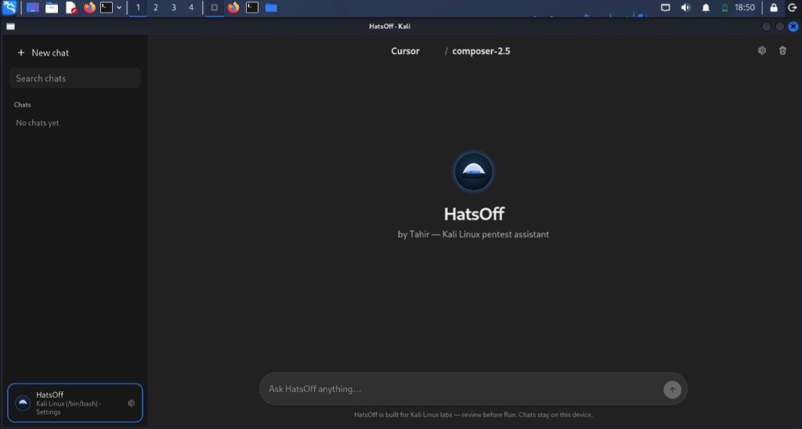

# HatsOff

**Kali Linux–oriented AI assistant for authorized penetration testing** — desktop chat + CLI.

HatsOff is the desktop experience built on the KaliGPT / HackerX agent stack: multi-provider AI, local chat history, and Kali-compatible command/script runners with mid-run prompts.

> **Credits / upstream.** HatsOff (this v2 desktop + agent work) was created following and building on **[SudoHopeX/KaliGPT](https://github.com/SudoHopeX/KaliGPT)** (HackerX) by [SudoHopeX](https://github.com/SudoHopeX) / Krishna Dwivedi. Full credit for the original Kali Linux CLI agentic assistant — please star and support that project.

> **Authorized use only.** Use on labs, CTFs, and engagements you are allowed to test. See [DISCLAIMER.md](DISCLAIMER.md) and [LICENSE](LICENSE).

<p align="center">
  
</p>

<p align="center">
  
</p>

---

## Features

| Area | What you get |
|------|----------------|
| **Desktop UI** | ChatGPT-style local app, maximized window when pywebview works |
| **Providers** | Gemini, ChatGPT, Ollama, OpenRouter, LiteLLM, Cursor |
| **Labs** | Run code blocks; **Run script (AI ordered)** with discover → ask → act on Kali bash |
| **Inputs** | Mid-run dropdowns for interfaces/targets; UI-only ask steps |
| **Persistence** | Chats in `~/.kaligpt/chats.db`; keys in local `api.config.json` (not committed) |
| **CLI** | Classic KaliGPT CLI agents still available |

---

## Quick start (Kali Linux)

### One-shot install + run

From the project root:

```bash
chmod +x ./install
./install
```

This will:

1. Install apt packages (Python, GTK/gi for the desktop window)
2. Create `.venv` with `--system-site-packages`
3. Install Python deps
4. Create config from the example if missing
5. Install a **`hatsoff`** command into `~/.local/bin`
6. Add a Kali application menu entry
7. Launch HatsOff

Afterwards, start it like any other tool:

```bash
hatsoff
hatsoff --browser
hatsoff --no-window
```

Install without launching / refresh after `git pull`:

```bash
./install --no-run
./install --update
```

If HatsOff opens in the browser with `No module named 'gi'`, your `.venv` can’t see system GTK. Re-run `./install --no-run` (it recreates the venv with `--system-site-packages`), or:

```bash
sudo apt install -y python3-gi python3-gi-cairo gir1.2-gtk-3.0 gir1.2-webkit2-4.1
rm -rf .venv && ./install --no-run
hatsoff
```

If `hatsoff` is “command not found”, open a new terminal or:

```bash
export PATH="$HOME/.local/bin:$PATH"
```

### Manual setup

```bash
cd ~/Desktop/KaliGPT
python3 -m venv --system-site-packages .venv
source .venv/bin/activate
pip install -r requirements/pip-requirements.txt
cp agents/utils/api.config.example.json agents/utils/api.config.json
python -m agents.desktop
```

Open **Settings** in the app and set API keys (or edit `agents/utils/api.config.json`).

### Desktop window vs browser

```bash
python -m agents.desktop              # window (needs GTK/gi) or falls back to browser
python -m agents.desktop --browser    # force browser
python -m agents.desktop --no-window  # API only → open http://127.0.0.1:8765
```

**Native window on Kali** (fixes `No module named 'gi'`):

```bash
sudo apt install -y python3-gi python3-gi-cairo gir1.2-gtk-3.0 gir1.2-webkit2-4.1
# recreate venv WITH --system-site-packages (see above), then:
python -m agents.desktop
```

---

## Providers

Configure in **Settings** or `agents/utils/api.config.json`:

| ID | Notes |
|----|--------|
| `gemini` | Google AI Studio key |
| `chatgpt` | OpenAI key |
| `ollama` | Local URL (default `http://localhost:11434`) |
| `openrouter` | OpenRouter key |
| `litellm` | Routes via provider env vars |
| `cursor` | Cursor API key + `cursor-sdk`; local agent bridge may be required |

Cursor troubleshooting on Kali:

```bash
pip install -U cursor-sdk
PYTHONPATH=. python -u -m agents.cursor_daemon   # should print {"ok":true,"ready":true}
# optional: export KALIGPT_CURSOR_INPROCESS=1
```

---

## Lab runner (desktop)

1. Ask HatsOff for Kali commands / a workflow.
2. **Run** on a code block — executes via Kali `/bin/bash` when available.
3. **Run script (AI ordered)** — AI builds discover → ask → act steps:
   - discovery commands run first
   - mid-run **dropdown** for choices (iface, host, etc.)
   - remaining steps use `{{placeholders}}`

Only run against systems you are authorized to test.

---

## CLI (KaliGPT legacy)

```bash
python -m agents                 # default provider from config
python -m agents.gemini
python -m agents.chatgpt
python -m agents.ollama
python -m agents.openrouter
python -m agents.litellm_provider
python -m agents.cursor
```

Installer / `kaligpt` shim (upstream style): see [install.sh](install.sh) and [requirements/globals.md](requirements/globals.md).

---

## Tests

```bash
source .venv/bin/activate
pip install pytest
python -m pytest tests/ -q
```

---

## Project layout

```
agents/
  desktop/           # HatsOff Flask UI + runner
  cursor*.py         # Cursor SDK daemon / worker
  utils/             # config, prompts, tools
  *.py               # CLI providers (gemini, chatgpt, …)
docs/
  DESKTOP.md         # Detailed desktop guide
requirements/
tests/
```

More: [docs/DESKTOP.md](docs/DESKTOP.md) · [DEVELOPER.md](DEVELOPER.md) · [CONTRIBUTING.md](CONTRIBUTING.md) · [SECURITY.md](SECURITY.md)

---

## Security notes

- **Never commit** `agents/utils/api.config.json` (gitignored). Use the example file.
- If a real API key was ever committed, **rotate it** in the provider dashboard.
- Command runner executes on the host shell — review prompts before **Run**.

---

## Disclaimer

Pentest for good. Unauthorized access to systems is prohibited. See [DISCLAIMER.md](DISCLAIMER.md).

---

## Credits

| Project | Authors | Notes |
|---------|---------|--------|
| **[SudoHopeX/KaliGPT](https://github.com/SudoHopeX/KaliGPT)** (HackerX) | [SudoHopeX](https://github.com/SudoHopeX) / Krishna Dwivedi | Upstream Kali Linux CLI agentic AI this work is based on |
| **HatsOff** | Tahir | Desktop UI, lab runners, and related v2 additions |

Support the original project: [github.com/SudoHopeX/KaliGPT](https://github.com/SudoHopeX/KaliGPT)
